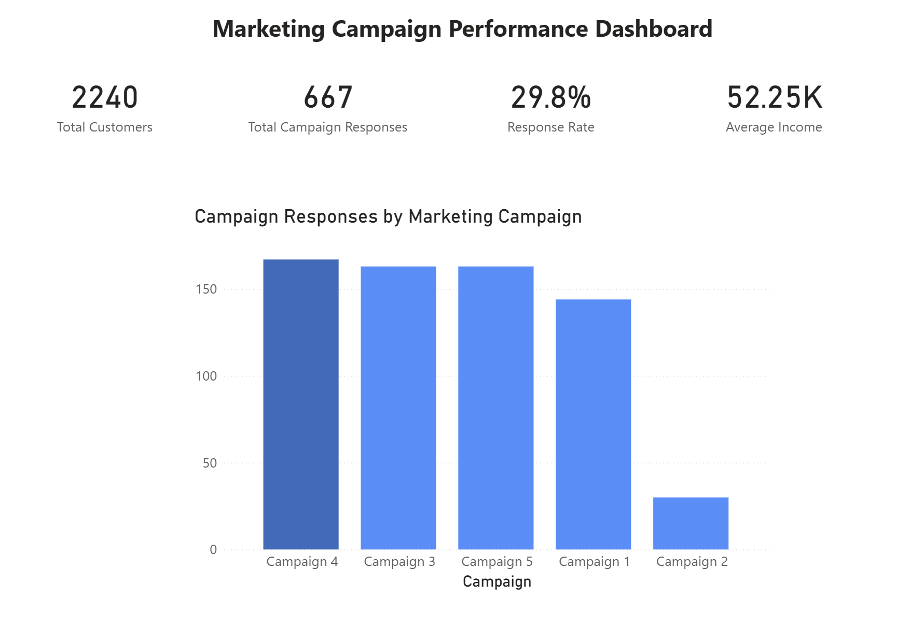

# Marketing Campaign Performance Dashboard

This project analyses the performance of five marketing campaigns using Power BI, demonstrating dashboard design, Power Query data transformation, and DAX measures.

## Key Metrics

- Total Customers: 2,240
- Total Campaign Responses: 667
- Response Rate: 29.8%
- Average Customer Income: $52.25K

## Key Insight

Campaign 4 generated the highest number of responses, while Campaign 2 performed significantly worse than the other campaigns.

## Dashboard

## Tools Used

- Power BI
- Power Query
- DAX
